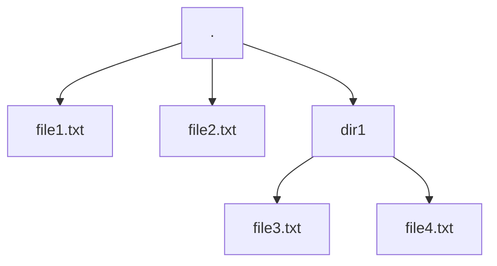

# express-generator

This is my first attempt at using express-generator
Using pug rather than jade...

```
npx express-generator --view=pug myapp01
cd myapp01
DEBUG=myapp01:* npm start
```

<b>316 directories, 1296 files created</b>

See [tree][def]

[def]: tree.md

## Directory Structure

